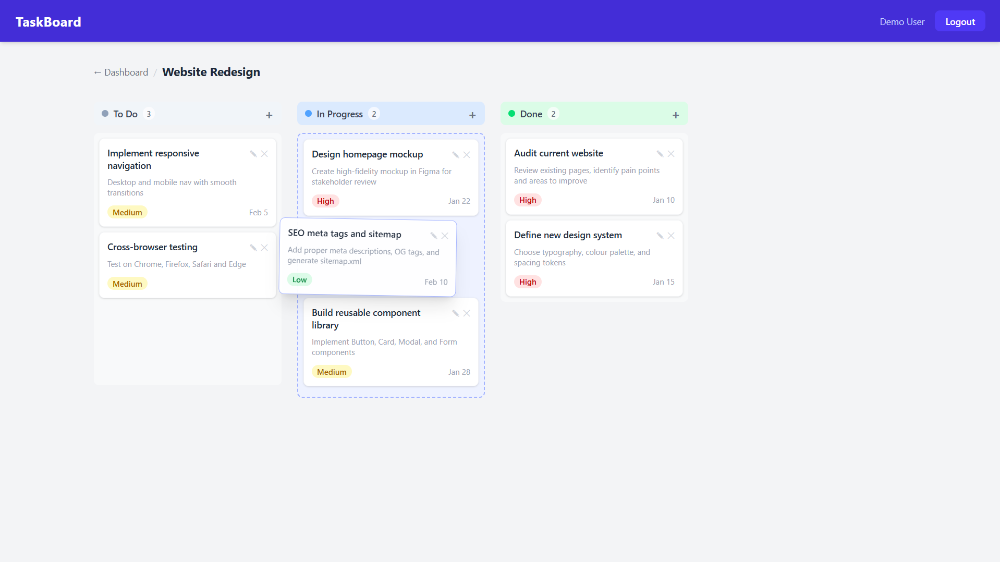

# TaskBoard — MERN Stack Task Manager


A full-stack Kanban board application built with the MERN stack. Create boards, manage tasks across **To Do / In Progress / Done** columns, and drag-and-drop cards to update their status in real time.



---

## Features

- **JWT Authentication** — register, login, persistent sessions via localStorage
- **Board Management** — create and delete personal boards
- **Task CRUD** — create, edit, and delete tasks with title, description, priority, and due date
- **Drag & Drop** — move tasks between columns; status persists to the database
- **Priority Labels** — Low / Medium / High with colour-coded badges
- **Protected Routes** — unauthenticated users are redirected to `/login`
- **Toast Notifications** — instant feedback on every action
- **Responsive UI** — Tailwind CSS 4.2, works on desktop and mobile

---

## Tech Stack

| Layer | Technology |
|---|---|
| Frontend | React 19.2, Vite 7.3, Tailwind CSS 4.2 |
| Routing | React Router 7.13 |
| Drag & Drop | @hello-pangea/dnd 18.0 |
| HTTP Client | Axios 1.13 |
| Backend | Node.js, Express 5.2 |
| Database | MongoDB, Mongoose 9.2 |
| Auth | JWT 9.0, bcryptjs 3.0 |
| Notifications | react-hot-toast 2.6 |

---

## Project Structure

```
├── server/                  # Express API
│   ├── src/
│   │   ├── controllers/     # Route handlers
│   │   ├── middleware/      # JWT auth middleware
│   │   ├── models/          # Mongoose schemas (User, Board, Task)
│   │   ├── routes/          # API route definitions
│   │   └── seed.js          # Demo data seeder
│   ├── .env.example
│   └── package.json
│
├── client/                  # React frontend
│   ├── src/
│   │   ├── api/             # Axios instance with JWT interceptor
│   │   ├── components/      # Navbar, BoardCard, TaskCard, KanbanColumn, TaskModal
│   │   │   └── ui/          # Shared primitives: FormField, Input, Button
│   │   ├── context/         # AuthContext (global auth state)
│   │   ├── hooks/           # useAuth hook
│   │   ├── pages/           # Login, Register, Dashboard, Board
│   │   └── router/          # AppRouter, ProtectedRoute
│   ├── .env.example
│   └── package.json
│
├── docs/images/             # Screenshots
├── docker-compose.yml       # MongoDB via Docker
└── README.md
```

---

## Getting Started

### Prerequisites

- [Node.js v18+ (tested on v24.13.0)](https://nodejs.org)
- [Docker](https://www.docker.com) — for MongoDB (or MongoDB installed locally)

### 1. Clone the repository

```bash
git clone https://github.com/saadshahidit/task-board.git
cd task-board
```

---

### 2. Set up environment variables

**server/.env:**

```env
MONGO_URI=mongodb://localhost:27017/task-board
JWT_SECRET=your_long_random_secret_here
PORT=5000
NODE_ENV=development
```

**client/.env:**

```env
VITE_API_URL=http://localhost:5000/api
```

### 3. Start MongoDB

**Option A — Docker (recommended):**

```bash
docker compose up -d
```

**Option B — Local MongoDB:** Make sure MongoDB is running locally or use a [MongoDB Atlas](https://www.mongodb.com/cloud/atlas) connection string in `server/.env`.

### 4. Install dependencies and start

```bash
# Server
cd server
npm install
npm run dev

# Client (new terminal)
cd client
npm install
npm run dev
```

### 5. Seed demo data (optional)

```bash
cd server && npm run seed
```

> Demo login — `demo@taskboard.com` / `password123`

Open `http://localhost:5173` in your browser.

---

## API Reference

### Auth — `/api/auth`

| Method | Endpoint | Description |
|---|---|---|
| POST | `/register` | Register a new user |
| POST | `/login` | Login and receive a JWT |
| GET | `/me` | Get current user (auth required) |

### Boards — `/api/boards` (auth required)

| Method | Endpoint | Description |
|---|---|---|
| GET | `/` | List all boards for the logged-in user |
| POST | `/` | Create a new board |
| PUT | `/:id` | Update board title/description |
| DELETE | `/:id` | Delete board and all its tasks |

### Tasks — `/api/tasks` (auth required)

| Method | Endpoint | Description |
|---|---|---|
| GET | `/:boardId` | Get all tasks for a board |
| POST | `/` | Create a task |
| PUT | `/:id` | Update task details |
| PATCH | `/:id/move` | Move task to a different column |
| DELETE | `/:id` | Delete a task |

---

## Deployment

| Part | Platform |
|---|---|
| Frontend | [Vercel](https://vercel.com) |
| Backend | [Render](https://render.com) |
| Database | [MongoDB Atlas](https://www.mongodb.com/cloud/atlas) |

When deploying, set the environment variables on each platform:
- On Render: set `MONGO_URI`, `JWT_SECRET`, `PORT`, `NODE_ENV`
- On Vercel: set `VITE_API_URL` to your live Render backend URL (e.g. `https://your-app.onrender.com/api`)

---

## License

MIT
